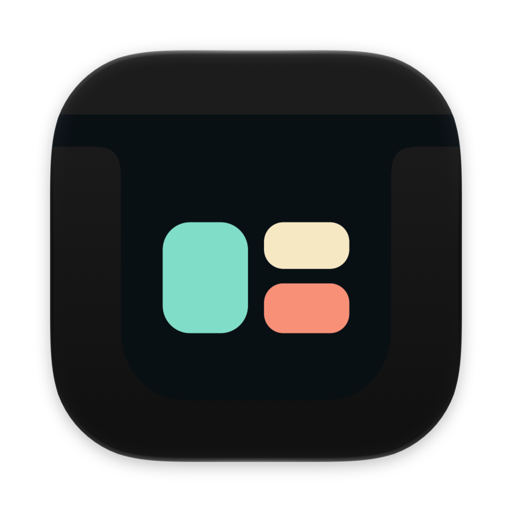
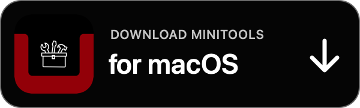

<h1 align="center">
  
  <br>
  MiniTools
</h1>

<p align="center">
  A focused dynamic island for macOS — useful when you need it, invisible when you do not.
</p>

<p align="center">
  <a href="https://github.com/LuisGil15/MiniTools/releases/latest"></a>
  
  
  
  
</p>

<p align="center">
  <a href="https://ko-fi.com/luisgildev"></a>
  <a href="https://www.buymeacoffee.com/luisgil"></a>
</p>

<p align="center">
  <a href="https://github.com/LuisGil15/MiniTools/releases/download/v1.0.5/MiniTools-1.0.5.dmg"></a>
</p>

MiniTools turns the area around your Mac's notch into a compact workspace for
music, time-sensitive tasks, and everyday information. Hover to expand it,
interact with what you need, and let it collapse back into the display.

## What is included

- Music artwork, playback controls, and a compact visualizer.
- Persistent timers with island alerts and notifications.
- Calendar events, event creation, and macOS Reminders.
- Local weather and a persistent ToDo list.
- Notch calibration, multi-display placement, and full-screen auto-hide.
- Compact and expanded layouts designed to preserve the physical notch alignment.

## Install

**Requirements**

- macOS Ventura 13 or later.
- A Mac with Apple silicon.

### Homebrew (recommended)

```bash
brew install --cask LuisGil15/minitools/minitools
```

Homebrew downloads the signed and notarized DMG from this repository and
verifies its SHA-256 checksum. To install updates later:

```bash
brew update
brew upgrade --cask minitools
```

The Cask is maintained in
[`LuisGil15/homebrew-minitools`](https://github.com/LuisGil15/homebrew-minitools).

### Manual installation

1. Download [`MiniTools-1.0.5.dmg`](https://github.com/LuisGil15/MiniTools/releases/download/v1.0.5/MiniTools-1.0.5.dmg).
2. Open the disk image.
3. Drag **MiniTools** to **Applications**.
4. Launch MiniTools and grant only the permissions needed by the features you use.

> [!NOTE]
> MiniTools is signed with Developer ID and notarized by Apple. You should not
> need to disable Gatekeeper or remove the quarantine attribute.

Prefer a portable archive? The notarized ZIP and SHA-256 checksums are available
on the [latest release page](https://github.com/LuisGil15/MiniTools/releases/latest).

## Optional plugins

The base app includes only the core MiniTools experience. Plugins are separate,
optional downloads and are never required to run the app.

Available first-party plugins include:

- Launchpad
- Caffeine
- Ports
- Screenshot Board
- Mini Terminal
- Agent Pulse

Install or remove `.minitoolplugin` packages from **MiniTools → Settings →
Plugins**. Browse the
[plugin catalog](https://github.com/LuisGil15/MiniTools-Plugins-Distribution)
or review the
[plugin source and contract](https://github.com/LuisGil15/MiniTools-Plugins).

## Using MiniTools

- Hover over the notch to open the compact island.
- Expand it to access all enabled tabs.
- Right-click the island to open Settings or quit MiniTools.
- Pin a tab when you want its compact experience to become the default.
- Choose whether MiniTools appears on the active display, selected displays, or all displays.

## Updates and integrity

Every public build is:

1. Signed with a **Developer ID Application** certificate.
2. Submitted to Apple's notarization service.
3. Stapled and validated with Gatekeeper.
4. Published with a SHA-256 checksum.

To verify a downloaded artifact, place its `.sha256` file beside it and run:

```bash
shasum -a 256 -c MiniTools-1.0.5.dmg.sha256
```

## Compatibility note

Music integration uses macOS `MediaRemote`, a private system framework that can
change between macOS releases. Please report regressions with your macOS version
and Mac model.

## Links

- [Latest release](https://github.com/LuisGil15/MiniTools/releases/latest)
- [Distribution repository](https://github.com/LuisGil15/MiniTools)
- [Report an issue](https://github.com/LuisGil15/MiniTools/issues)
- [Plugin catalog](https://github.com/LuisGil15/MiniTools-Plugins-Distribution)

## Support MiniTools

If MiniTools makes your day a little easier, you can support its continued
development on [Ko-fi](https://ko-fi.com/luisgildev) or
[Buy Me a Coffee](https://www.buymeacoffee.com/luisgil).

<details>
<summary>Release maintenance</summary>

Each release uses a semantic version tag and includes signed, notarized DMG and
ZIP artifacts with matching SHA-256 files. `latest.json` must only be updated
after uploaded assets have been downloaded and verified. Never replace an
existing version with a different binary.

</details>

---

<p align="center">Made with care by Luis Gil.</p>
